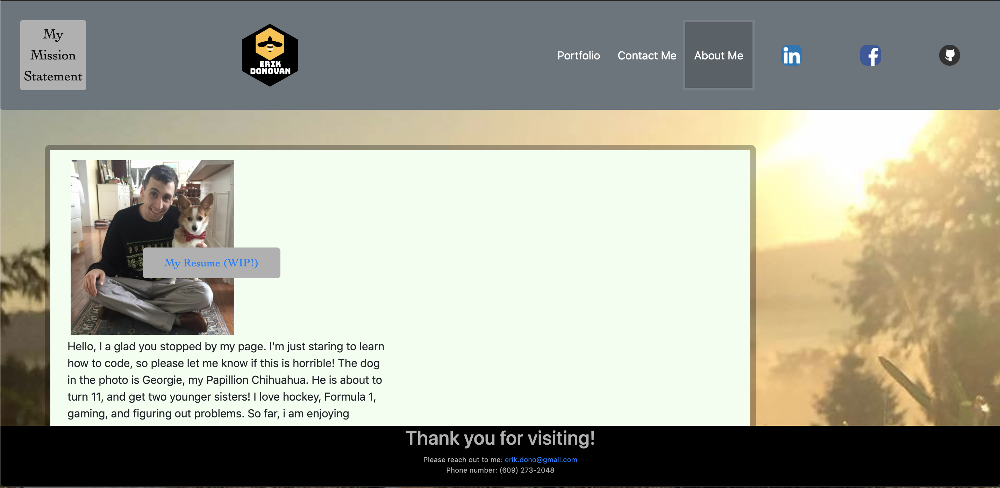

# ProfessionalPortfolio
This will be an updated portfolio page (WIP). I will be continuously changing this page, so please keep checking back for updates :)

my portfolio is now dynamic, but I can see how to make it even more usable. The Javascript allows the html to all stay on one page, and every link opens in a separate tab. This allows you to easily come back, if you need to access more info. 

Here is a breakdown of my pages:

-       Main Page 
My main page is my mission statement. Admittedly, this could be more eye-catching, and could use the logo that I made. For now, this page will serve as a holder for some basic text about what I plan on doing, and why.

- - limitations:  Resizing Iphone and Ipad

While the text is not broken on ipad and iphone, the background had a gap on the Ipad setting, see below. 
        
         
Also, when resizing the page, the header overtakes a large portion of the text. This is true of all pages. 
        
-       Portfolio Page  

The portfolio page itself has snapshots of two applications and my project. The image itself is a link to the application, while the text in front is a link to the git hub repo for the project. I look forward to putting more items on here! 

- - Limitations: Resizing Iphone and Ipad

The text for the github stays ontop of the image, but the images do not resize. This causes the page to look a bit choppy. 

-       About Me Page

